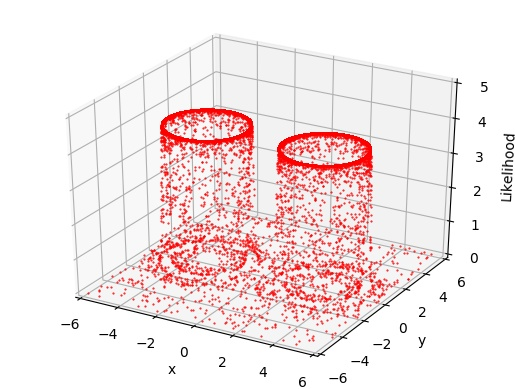

************
Installation
************

The **MPI libaray** (e.g., MPICH) and **GNU Scientific Library** (GSL; http://www.gnu.org/software/gsl) are required. One needs to install these libraries in advance.
If one wants to use python wrapper, python module **mpi4py** is also required.

To create the C library ``libnest.so``, edit the paths for library and header files in Makefile and then compile using the following terminal command

.. code-block:: bash

  make

Then add the path of ``libnest.so`` to the system environment variable "LD_LIBRARY_PATH". Edit "bashrc" file in home directory 
and add a line as 

.. code-block:: bash

  export LD_LIBRARY_PATH=/path/to/libnest.so/:$LD_LIBRARY_PATH

After creating ``libnest.so``, to create the Python module ``cydnest.so``, use terminal command

.. code-block:: python 
  
  python2 setup.py buid_ext --inplace

or 

.. code-block:: python 

  python2 setup.py install

.. note::
  Only **python2** is supported at present.

******
Tests
******

``CDNest`` provides several tests to guide its useage.

Test I --- model1.c
===================

The likelihood function is (Brewer et al. 2009, arXiv:0912.2380):

.. math::
  
   L(x_1, x_2, ..., x_20) = \prod_i^{20}\frac{1}{\sqrt{2\pi v^2}}\exp\left(-\frac{x_i^2}{2v^2}\right) + 100 \prod_i^{20}\frac{1}{\sqrt{2\pi u^2}}\exp\left(-\frac{(x_i-0.031)^2}{2u^2}\right),

where :math:`v=0.1` and :math:`u=0.01`. The true value of evidence is :math:`\log(101)\approx4.6151`. The obtained value by CDNest for my running is about 4.5807. Note that CDNest is not easy to estimate the uncertainty. Different runnings may give slightly different values. A possible way for estimating the uncertainty of evidence is running CDNest many times.

Test II --- model2.c
====================

A linear regression (Figure 4 in Brewer et al. 2016, arXiv:1606.0375). The obtained evidence by CDNest is -175.45708.

Test III --- model3.c
=====================

Gaussian shells likelihood (Feroz et al. 2008, arXiv:0809.3437):

.. math::
  
  L(\boldsymbol{\theta})= \frac{1}{\sqrt{2\pi w_1^2}}\exp\left[-\frac{(|\boldsymbol{\theta-c_1}|-r_1)^2}{2w_1^2}\right]+\frac{1}{\sqrt{2\pi w_2^2}}\exp\left[-\frac{(|\boldsymbol{\theta-c_2}|-r_2)^2}{2w_2^2}\right],

where :math:`w_1=w_2=0.1, r_1=r_2=2, \boldsymbol{c_1}=(3, 0)` and :math:`\boldsymbol{c_2}=(-3, 0)`. The true value of evidence is -1.75. The obtained value by CDNest is about -1.7479.

Test IV in Python --- example.py
================================

Multidimensional Gaussian.

The true value of evidence is -11.51, and the obtained value by CDNest is -11.52.