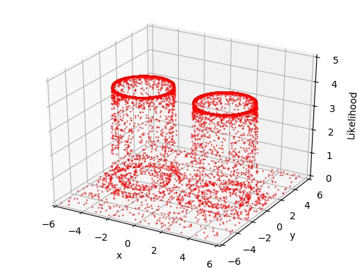
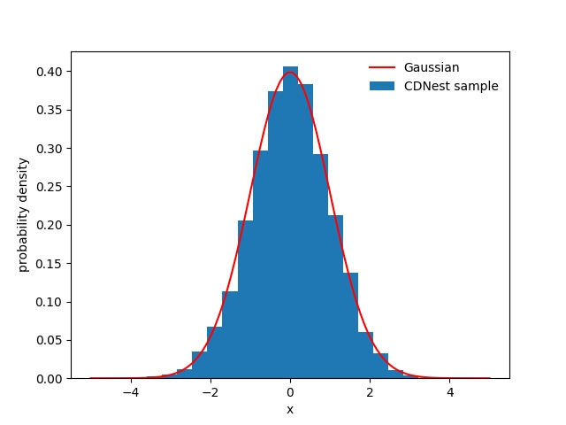
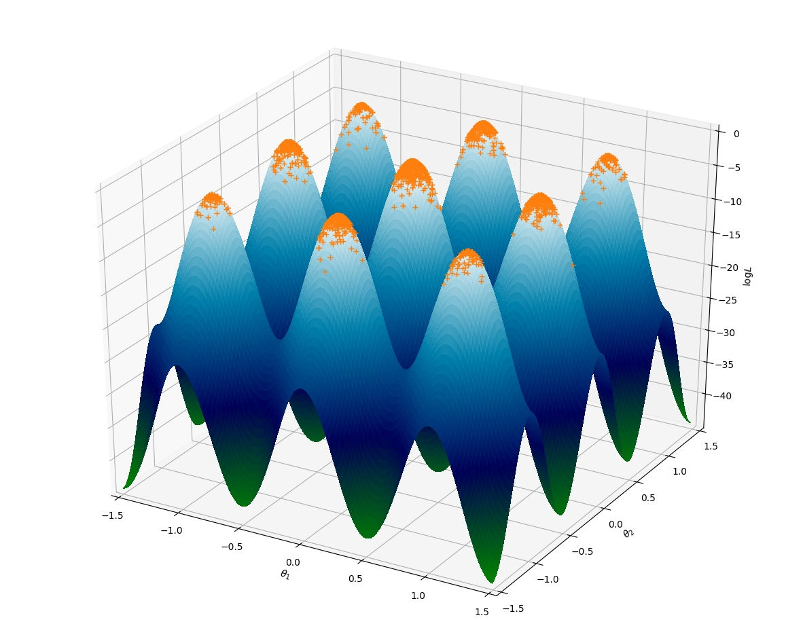

******
Tests
******

**CDNest** provides several tests to guide its useage in the subdirectory **tests/**.

Test I --- model1.c
===================

The likelihood function is (Brewer et al. 2009, arXiv:0912.2380):

.. math::
  
   L(x_1, x_2, ..., x_20) = \prod_i^{20}\frac{1}{\sqrt{2\pi v^2}}\exp\left(-\frac{x_i^2}{2v^2}\right) + 100 \prod_i^{20}\frac{1}{\sqrt{2\pi u^2}}\exp\left(-\frac{(x_i-0.031)^2}{2u^2}\right),

where :math:`v=0.1` and :math:`u=0.01`. The true value of evidence is :math:`\log(101)\approx4.6151`. The obtained value by CDNest for my running is about 4.5807. Note that CDNest is not easy to estimate the uncertainty. Different runnings may give slightly different values. A possible way for estimating the uncertainty of evidence is running CDNest many times.

To run this test, using the following command:

.. code-block:: bash
  
  mpiexec -n np ./dnest 1

Test II --- model2.c
====================

A linear regression (Figure 4 in Brewer et al. 2016, arXiv:1606.0375). The obtained evidence by CDNest is -175.45708.

To run this test, using the following command:

.. code-block:: bash
  
  mpiexec -n np ./dnest 2

Test III --- model3.c
=====================

Gaussian shells likelihood (Feroz et al. 2008, arXiv:0809.3437):

.. math::
  
  L(\boldsymbol{\theta})= \frac{1}{\sqrt{2\pi w_1^2}}\exp\left[-\frac{(|\boldsymbol{\theta-c_1}|-r_1)^2}{2w_1^2}\right]+\frac{1}{\sqrt{2\pi w_2^2}}\exp\left[-\frac{(|\boldsymbol{\theta-c_2}|-r_2)^2}{2w_2^2}\right],

where :math:`w_1=w_2=0.1, r_1=r_2=2, \boldsymbol{c_1}=(3, 0)` and :math:`\boldsymbol{c_2}=(-3, 0)`. The true value of evidence is -1.75. The obtained value by CDNest is about -1.7479.

To run this test, using the following command:

.. code-block:: bash
  
  mpiexec -n np ./dnest 3

Test IV in Python --- gauss.py
================================

Generate samples form a Gaussian distribution.

To run this test, using the following command:

.. code-block:: bash
  
  mpiexec -n np python gauss.py

Test V in Python --- mulgauss.py
================================

Multidimensional Gaussian.

The true value of evidence is -11.51, and the obtained value by CDNest is -11.52.

To run this test, using the following command:

.. code-block:: bash
  
  mpiexec -n np python mulgauss.py

Test VI in Python --- rastrigin.py
==================================

The two-dimensional Rastrigin test function is defined by 

.. math::
  
  f(\theta) = An + \sum_{i=1}^{n}[\theta_i^2 - A \cos(2\pi\theta_i)],

  A = 10, n=2, \theta_i \sim [-5.12, 5.12]

The likelihood is defined to be :math:`L = \exp[-f(\theta)]`.

To run this test, using the following command:

.. code-block:: bash
  
  mpiexec -n np python rastrigin.py